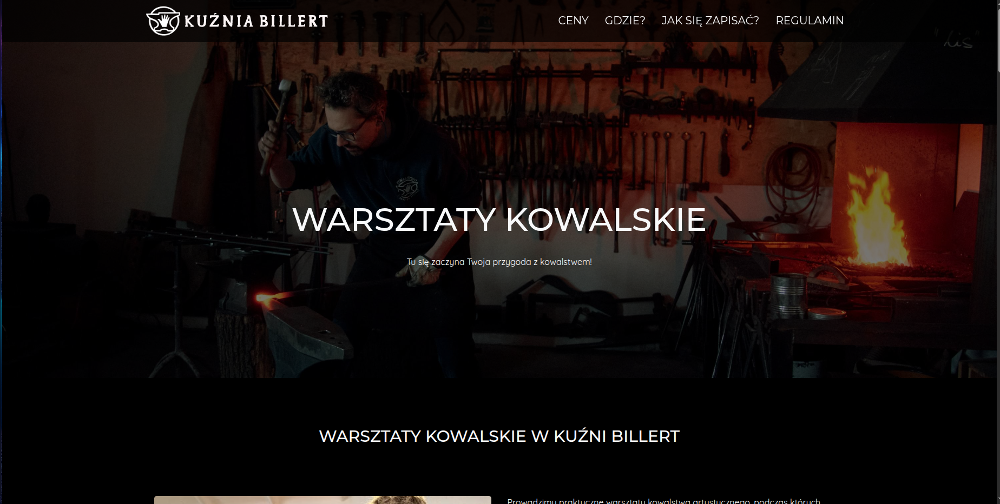

# 🌐 [warsztatykowalskie.pl](https://warsztatykowalskie.pl) – Informational Website for Kuźnia Billert

This is my **second commercial project** for **Kuźnia Billert**, a family-run company specializing in artistic blacksmithing.

---

## 🧩 About the Project

The website was created as a **replacement for a previous version** made using a website builder, which was inefficient and difficult to scale.  
The main goals were to:

- Reduce ongoing costs (by ditching the builder),
- Launch a fast and simple website quickly,
- Make it accessible on all devices,
- Clearly present the company’s services in a professional way.

🛠️ I developed the site in just **2 days** (+ a few follow-up corrections). It's not a perfect project — and it wasn’t supposed to be. Its main value lies in simplicity, speed, and clean presentation.

---

## ✅ Technologies & Features

- 📱 **Mobile First & Responsive Web Design** – optimized for all screen sizes
- ♿ **Accessibility (WCAG)** – applied good accessibility practices
- 🔍 **SEO (Search Engine Optimization)** – implemented semantic HTML, heading hierarchy, metadata, and basic optimizations
- 🐦 **Social sharing** – added Twitter Cards and social meta tags
- 🍪 **Cookie handling** – integrated with GlowCookies
- 🛡️ **Security & UX enhancements**:
  - Custom 404 Not Found page
  - Redirects: force HTTPS, remove `www` and `index.html`
  - Hotlink protection
- 📊 **Integrations**:
  - Google Analytics
  - Google Search Console
- 💄 **UI Framework**: Bootstrap 5
- 🧠 **Mockup design** in Figma – [view mockup](https://www.figma.com/proto/FhUHkkQHR5iVeCidYLnwvV/Strona-dla-Andrzeja?t=LR9KlAt3lp2OlvoE-0&scaling=scale-down&content-scaling=fixed&page-id=0%3A1&node-id=1-2)

---

## 🔗 Links

- 🔴 **Live site**: [https://warsztatykowalskie.pl](https://warsztatykowalskie.pl)  
- 🎨 **Figma mockup**: [click here](https://www.figma.com/proto/FhUHkkQHR5iVeCidYLnwvV/Strona-dla-Andrzeja?t=LR9KlAt3lp2OlvoE-0&scaling=scale-down&content-scaling=fixed&page-id=0%3A1&node-id=1-2)

---

## 💬 Summary

This project marks another milestone in my journey as a web developer.  
It was also the **first project I built based on a visual mockup** — and I quickly learned how much smoother communication and revisions become when a mockup is involved.

With attention to detail (404 page, cookies, redirects, SEO, responsive layout), even a small site can look and feel professional.

---

📌 *Feel free to reach out if you have any questions!*
